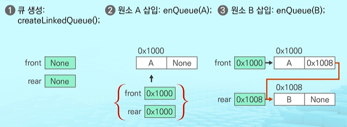
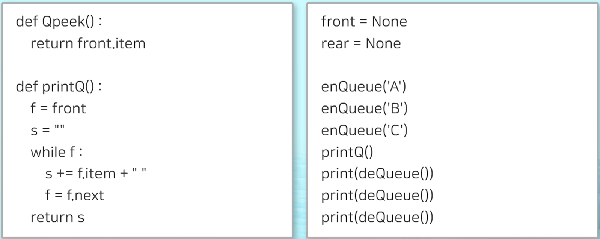
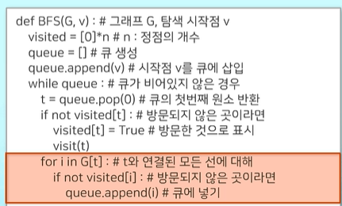

# Queue

## 1. Queue 자료구조의 개념

#### 1) Queue의 특성

- 삽입, 삭제의 위치가 <span style = 'background-color:#fff5b1'>제한적인 자료구조</span>

- <span style='background-color:#fff5b1'>선입선출</span> 구조(FIFO:First In First Out)
  
  - 큐에 삽입한 순서대로 원소가 저장
  
  - 가장 먼저 삽입(First In)된 원소는 가장 먼저 삭제(First Out)

- 큐의 예 : 서비스 대기 행렬

<br>

#### 2) Queue의 구조 및 기본연산

- __큐의 선입선출 구조__


<br>

#### 3) 큐의 주요 연산

| 연산                | 기능                                     |
|:----------------- |:-------------------------------------- |
| __enQueue(item)__ | 큐의 <u>뒤쪽(rear)</u>에 원소를 삽입하는 연산        |
| __deQueue()__     | 큐의 <u>앞쪽(front)</u>에 원소를 삭제하고 반환하는 연산  |
| __createQueue()__ | <u>공백상태의 큐</u>를 생성하는 연산                |
| __isEmpty()__     | 큐가 <u>공백상태인지 확인</u>하는 연산               |
| __isFull()__      | 큐가 <u>포화상태인지 확인</u>하는 연산               |
| __Qpeek()__       | 큐의 앞(front)쪽에서 <u>원소를 삭제없이 반환</u>하는 연산 |

<br> 

#### 4) Queue의 연산 과정

- 큐의 기본 연산과정
  
  1) 공백 큐 생성: __createQueue()__
     
     - 빈 큐를 생성하면 자료가 없는 상태이기 때문에, front와 rear가 __-1__ 로 초기화 됨
  
  2) 원소 A 삽입: __enQueue(A)__
     
     - 원소 A를 삽입하면 front는 -1로 그대로이나, rear의 값이 __0__ 이 됨
  
  3) 원소 B 삽입: **enQueue(B)**
     
     - 원소 B를 삽입하면 front는 -1로 그대로이나, rear의 값이 __1__ 이됨
  
  
  
  - 모든 원소를 반환하고 나면, front값과 rear의 값이 같아지므로 큐가 비어 있음을 알 수 있음
  
  <br>
  
  #### 5) Queue의 종류
  
  
  
  

<br>

<br>

<br>

## 2. Queue의 종류

#### 1) 선형 Queue의 특징

1. __1차원 리스트__ 를 이용한 큐
   
   - 큐의 크기 = 리스트의 크기
   
   - <span style = 'color:red'>front:</span> 저장된 __첫 번째__ 원소의 인덱스
   
   - <span style = 'color:red'>rear:</span> 저장된 __마지막__ 원소의 인덱스

2. 상태 표현
   
   - 초기 상태: <span style = 'color:red'>front = rear = -1</span>
   
   - 공백 상태: <span style = 'color:red'>front = rear</span>
   
   - 포화 상태: <span style = 'color:red'>rear = n-1</span> (n: 리스트의 크기, __n-1__: 리스트의 마지막 인덱스)

<br>

#### 2) 선형 Queue의 구현

- <span style = 'background-color:#fff5b1'>초기 __createQueue()__</span> -> 초기 공백큐 생성
  
  - 크기 __n인 1차원 리스트__ 생성
  
  - __front, rear = -1__ 로 초기화

- __삽입:__ <span style = 'background-color:#fff5b1'>__enQueue(item)__</span> 
  
  - <span style = 'color:#2e8b57'>__마지막 원소 뒤에 새로운 원소를 삽입하기 위해__</span>
  1. rear값을 하나 증가시켜 새로운 원소를 삽입할 자리를 마련함
  
  2. 그 인덱스에 해당하는 리스트 원소 Q[rear]에 item을 저장

```python
def enQueue(item):
    global rear

    if isFull():
        print('Queue_Full')
    
    else:
        rear += 1
        Q[rear] = item
```

- __삭제:__<span style = 'background-color:#fff5b1'>__deque()__</span>
  
  - <span style = 'color:#2e8b57'>__가장 앞에 있는 원소를 삭제하기 위해__</span>
  1. front값을 하나 증가시켜 큐에 남아있는 첫 번째 원소로 이동함
  
  2. 새로운 첫 번째 원소를 리턴함으로써 삭제와 동일한 기능을 함

```python
def deQueue():
    
    global front
    
    if isEmpty():
        print('Queue_Empty')


    else:
        front += 1
        return Q[front]
```

- __공백상태 및 포화상태 검사:__<span style = 'background-color:#fff5b1'>__isEmpty(), isFull()__</span>
  
  - 공백상태 : __front = rear__
  
  - 포화상태 : __rear = n-1__ (__n:__ 리스트의 크기, __n-1:__ 리스트의 마지막 인덱스)

```python
#공백상태
def isEmpty():
    return front == rear

#포화상태
def isFull():
    return rear == len(Q) - 1
```

- __검색:__<span style = 'background-color:#fff5b1'>__Qpeek()__</span>
  
  - 가장 앞에 있는 원소를 검색하여 반환하는 연산
  
  - 현재 front의 한자리 뒤(front + 1)에 있는 원소, 즉 큐의 첫 번째에 있는 원소를 반환

```python
def Qpeek():
    if isEmpty():
        print('Queue_Empty')

    else:
        return Q[front + 1]
```

-  <span style = 'color : red'>__선형 큐의 문제점: 잘못된 포화상태 인식__</span>(아래 참고)


<br>

#### 3) 원형 Queue

- 원형 큐
  
  - 1차원 리스트를 사용하되, 논리적으로 __리스트의 처음과 끝이 연결__ 되어 원형 형태의 큐를 이룬다고 가정하고 사용함  

- 원형 큐의 __특징__


<br>

#### 4) 원형 큐의 구현

- __초기 공백큐 생성:__ <span style = 'background-color:#fff5b1'>__createQueue()__</span>
  
  - 크기 __n__ 인 1차원 리스트 생성
  
  - front, rear = 0으로 초기화

- __공백상태 및 포화상태 검사:__ <span style = 'background-color:#fff5b1'>__isEmpty(), isFull()__</span>
  
  - 공백상태: front =rear
    
    - 큐가 비어있는지 아닌지를 구분할 수 있음
  
  - 포화상태: 삽입할 rear의 다음 위치 = 현재 front
  
  - (rear + 1) % n = front

```python
#공백상태
def isEmpty():
    return front == rear

#포화상태
def isFull():
    return (rear + 1) % len(cQ) == front
```

- __삽입:__ <span style = 'background-color:#fff5b1'>__enQueue(item)__</span>
  
  - <span style = 'color:#2e8b57'>__마지막 새로운 원소를 삽입하기 위해__</span>
  1. rear값을 조정하여 새로운 원소를 삽입할 자리를 마련함: __rear < -(rear+1) % n__
  
  2. 인덱스에 해당하는 리스트 원소 cQ[rear]에 item을 저장

```python
def enQueue(item):
    global rear
    
    if isFull():
        print('Queue_Full')


    else:
        rear = (rear + 1) % len(cQ)
        cQ[rear] = item
```

- __삭제__ <span style = 'background=color:#fff5b1'>__deQueue(), delete()__</span>
  
  - <span style = 'color:#2e8b57'>__가장 앞에 있는 원소를 삭제하기 위해__</span>
  1. front값을 조정하여 삭제할 자리를 준비함
  
  2.  새로운 front원소를 리턴함으로써 삭제와 동일한 기능을 함

```python
def deQueue():

    global front
    
    if isEmpty():
        print('Queue_Empty')
    else:
        front = (front + 1) % len(cQ)


def delete():
    
    global front
    
    if is empty():
        print('Queue_Empty')
    else:
        front = (front + 1) % len(cQ)
```

- __파이썬으로 구현한 원형 큐의 삽입 및 삭제 함수__


<br>

#### 5) 리스트의 특성을 사용한 Queue


- __파이썬으로 구현한 원형 큐의 삽입 및 삭제 함수__


<br>

#### 6) 연결 Queue

- 연결 큐의 특징
  
  - 선형자료구조와 원형 자료구조의 단점을 보완한 자료구조
  
  - 단순 연결 리스트(Linked List)를 이용한 큐
    
    - 큐의 원소: 단순 연결 리스트의 노드
    
    - 큐의 원소 순서: 노드의 연결 순서, 링크로 연결되어 있음
    
    - front: 첫 번째 노드를 가리키는 링크
    
    - rear: 마지막 노드를 가리키는 링크
  
  - 상태 표현
    
    - 초기 상태: __front = rear = <span style = 'color : red'>None</span>__
      
      - front와 rear가 아무 노드도 가리키고 있지 않은 상태
    
    - 공백 상태: __front = rear = <span style = 'color : red'>None</span>__
    
    
    
    - 노드를 추가할 수 있는 연결 리스트의 특징 때문에 연결리스트는 포화상태가 없음
    
    - 위 와 같이 각 노드에 다음 노드를 포함하고 있는 링크가 포함되어 있음

- __연결 큐의 연산 과정__
  
  


- __초기 공백 큐 생성:__ <span style = 'background-color:#fff5b1'>__createLinkedQueue()__</span>
  
  - 리스트 노드없이 __포인터 변수__ 생성 함
  
  - front와 rear를 None으로 __초기화__

```python
front = None
rear = None
```

- __공백상태 검사:__ <span style = 'background-color:#fff5b1'>__isEmpty()__</span>
  
  - 공백상태: __front = rear = None__

```python
def isEmpty():
    return front == None
```

- __삽입:__ <span style = 'background-color:#fff5b1'>__enQueue(item)__</span>
  
  - 새로운 노드 생성 후 데이터 필드에 item 저장
  
  - 연결 큐가 공백인 경우, 아닌 경우에 따라 front, rear 변수 지정

```python
def enQueue(item): #연결 큐의 삽입 연산
    global front, rear
    newNode = Node(item) # 새로운 노드 생성
    
    if isEmpty(): #큐가 비어있다면
        front = newNode
    else:
        rear.next = newnode
    rear = newNode
```

- __삭제:__ <span style = 'background-color:#fff5b1'>__deQueue()__</span>
  
  - old가 지울 노드를 가리키게 하고, front 재설정
  
  - 삭제 후 공백큐가 되는 경우, rear도 None로 설정
  
  - old가 가리키는 노드를 삭제하고 메모리 반환

```python
def deQueue(): # 연결 큐의 삭제 연산
    
    global front, rear

    if isEmpty():
        print('Queue_Empty')
        return None

    item = front.item
    front = front.next


    if isEmpty():
        rear =None
    return item
```

- __파이썬으로 구현한 연결 큐__




<br>

#### 7) Queue 라이브러리

- __큐 모듈__


- __큐 모듈 활용__
  
  - 선입 선출의 큐 개념을 구현한 큐 클래스 활용
  
  


<br>

<br>

<br>

## 3. Queue의 활용

#### 1) 우선순위 Queue

- 우선순위 큐
  
  - 우선순위를 가진 항목들을 저장하는 큐
  
  - FIFO 순서가 아니라 <span style = 'color:red'>우선순위가 높은 순서대로</span> 먼저 나가게 됨
  
  

- __구현__
  
  - 리스트를 이용한 우선순위 큐
  
  - 우선순위 큐 라이브러리 사용

- __기본연산__

    

- 리스트를 이용한 우선순위 큐의 구현


<br>

#### 2) 버퍼


- 예) 버퍼 활용 - 키보드 버퍼의 수행 과정


<br>

<br>

<br>

## 4. BFS(너비 우선 탐색)

#### 1) BFS 특징

- 그래프 탐색 방법


- 입력 파라미터: 그래프 G와 탐색 시작점 v




[출처-SW Expert Academy](https://swexpertacademy.com/main/learn/course/subjectDetail.do?courseId=AVuPDN86AAXw5UW6&subjectId=AWOVIoJqqfYDFAWg&&)


