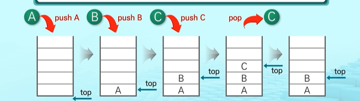

# STACK 1

## 1.자료구조의 개념

#### 1) 스택 자료구조의 개념

- 프로그램에서 중요성과 활용도가 높은 자료구조

- 쌓아올린 형태의 자료구조

- 후입선출(LIFO, Last In First Out)

- 선형구조: 자료간의 관계가 1대 1의 관계를 가짐

#### 2) stack의 구현

- 자료구조
  
  - 자료를 선형으로 저장할 저장소가 필요함
    
    - 파이썬에서는 리스트 사용가능
    
    - 저장소 자체를 스택이라 부르기도 함
    
    - 스택에서 마지막 삽입된 원소의 위치를  <u>top</u>이라 부름

- 연산
  
  - 삽입: 저장소에 자료를 저장, push라고 부름
  
  - 삭제: 저장소에서 자료를 꺼냄, 삽입한 자료의 역순으로 자료를 꺼냄, __pop__이라 부름
  
  - isEmpty: 스택이 공백인지 아닌지를 확인하는 연산
  
  - peek: 스택의 top에 있는 item(원소)를 반환하는 연산

#### 3) stack의 <u>연산</u>

- 스택의 __삽입/삭제__ 연산 과정
  
  - 빈 스택에 원소 A, B, C를 차례로 삽입 후 한 번 삭제하는 연산과정
    
    

- push 알고리즘
  
  - append()함수로 저장소의 마지막에 원소를 쌓을 수가 있음
  
  - top을 기억할 필요가 없음

```python
def push(item):
    s.append(item)
```

- pop 알고리즘
  
  - top이 __-1__이면 top의 초기값을 의미하며 스택에 자료가 없는 상태를 의미함
    
    - underflow처리를 함
  
  - s에서 top의 값을 반환하고 top은 하나 감소함
  
  - 파이선에서는 리스트의 크기를 len()함수를 통해 알 수 있으므로, top변수를 사용할 필요가 없음

```python
  def pop():
      if len(s) == 0:  #len(s)가 0이라면 stack에 자료가 없는 상태를 의미
          #underflow(len(s)가 0일때 underflow처리를 함)
          return
      else:
          return s.pop(-1) #stack의 마지막 값을 반환(pop메서드 사용: 인자값으로 -1을 입력하면 마지막 값을 반환하고 삭)
```

- stack 구현하기
  
  - 스택을 구현하기
  
  - 구현한 스택을 이용하여 3개의 데이터를 스택에 저장하고 다시 3변 꺼내서 출력하기

```python
def push(item):
    s.append(item)

def pop():
    if len(s) == 0:
        print('Stack is Empty!!') #underflow
        return
    else:
        return s.pop(-1)    
```

- 확인하기

```python
s = []


push(1)
push(2)
push(3)


print('pop item =>', pop()) #3
print('pop item =>', pop()) #2
print('pop item =>', pop()) #1
```

#### 4) 스택 구현 고려사항

- 리스트를 구현하여 스택을 구현하는 경우
  
  - 장점: 구현이 용이하다는 장점
  
  - 단점: 리스트의 크기를 변경하는 작업은 내부적으로 큰 overhead 발생 작업으로 많은 시간이 소요됨

- __해결방법__
  
  - 리스트의 크기가 변동되지 않도록 배열처럼 크기를 미리 정해놓고 사용하는 방법
  
  - 동적 연결리스트를 이용하여 저장소를 동적으로 할당하여 스택을 구현하는 방법
    
    - 장점: 구현이 용이힘
    
    - 단점: 리스트로 구현하는 것보다 구현이 복잡함

___

## 2. Stack의 응용

#### 1) 괄호검사

- 괄호의 종류: 대괄호('[', ']'), 중괄호('{', '}'), 소괄호('(', ')')

- 괄호를 올바르게 사용했는지 조사하는 조건
  
  1. 왼쪽 괄호의 개수와 오른쪽 괄호의 개수가 같아야 함
  
  2. 같은 괄호에서 왼쪽 괄호는 오른쪽 괄호보다 먼저 나와야 함
  
  3. 괄호 사이에는 포함관계만 존재 함
  
  

- 스택을 이용한 괄호 검사
  
  -  괄호수식이 끝났는데 스택에 괄호가 남아 있으므로 올바르게 괄호가 짝지어지지 않음 

- 괄호를 조사하는 알고리즘 개요

    

#### 2) Function call

- 함수 호출관리
  
  - 프로그램에서의 함수 호출과 복귀에 따른 수행 순서를 관리
    

- 함수 호출 수행 순서


- 함수호출 수행순서를 전체적으로 보여 줌


- 재귀호출
  
  1. 자기 자신을 호출하여 순환되는 것
  
  2. 함수에서 실행해야 하는 작업의 특성에 따라 일반적인 호출방식보다 재귀호출 방식을 사용하여 함수를 만들면 프로그램의 크기를 줄이고 간단하게 작성할 수 있음
  
  3. 단점 : 디버깅이 어렵고, 잘못 작성하게 되면 수행시간이 많이 소요됨

- 예) 재귀호출을 작성할 수 있는 함수 - __factorial__
  
  - n에 대한 factorial: 1부터 n까지의 모든 자연수를 곱하여 구하는 연산
  
  ```mathml
  n! = n x (n-1)!
  (n-1)! = (n-1) x (n-2)!
  (n-2)! = (n-2) x (n-3)!
  ...
  2! = 2 x 1!
  1! = 1
  ```
  
  - 마지막 구한 하위 값을 이용하여 상위 값을 구하는 작업을 반복

- 예) Factorial함수에서 n=4인 경우의 실행
  
  

___

___

## 3. Memorization

#### 1) 피보나치 수열

- 예) 재귀호출을 작성할 수 있는 함수 - 피보나치 수열을 구하는 함수
  
  1. 0과 1로 시작하고 이전의 두 수 합을 다음 항으로 하는 수열
     
     - 0, 1, 1, 2, 3, 5, 8, 13, ...
  
  2. 피보나치 수열의 i번째 값을 계산하는 함수F를 정의하면 다음과 같음
     
     - F0 = 0, F1 = 1
     
     - Fi  = Fi-1 + Fi-2 for i >= 2
  
  3. 위의 정의로부터 피보나치 수열의 i번째 항을 반환하는 함수를 재귀함수로 구현할 수 있음

#### 2) 피보나치 수를 구하는 재귀 함수

- 피보나치 수열을 구하는 함수의 알고리즘
  
  ```python
  def fibo(n):
      if n < 2:
        return n
  
    else:
        return fibo(n-1) + fibo(n-2)            
  ```
  
  - 문제점
    
    - 엄청난 중복 호출이 존재함
    
    - (아래 그림참고) 같은 입력값에 대한 함수 호출이 많이 중복되었다는 것을 확인 할 수 있음

        

#### 3) Memoization

- Memoization의 의미
  
  - 컴퓨터 프로그램을 실행할 때 <u>이전에 계산한 값</u>을 __메모리에 저장__ 해서 매번 다시 계산하지 않도록 <u>전체적인 실행속도를 빠르게</u> 하는 기술
  
  - DP(동적계획법)의 핵심이 되는 기술

- Memoization 단어의 의미
  
  - 글자 그대로 해석하면 '메모리에 넣기(to put in memory'라는 의미
  
  - '기억되어야 할 것'이라는 뜻의 라틴어 Memorandum에서 파생
  
  - 흔히 '기억하기', '암기하기'라는 뜻의 Memorization과 혼동하지만, 정확한 단어는 __Memoization__ 으로 동사형은 memoize임

- Memoization 방법을 적용한 알고리즘
  
  - 피보나치 수를 구하는 알고리즘에서 fibo(n)의 값을 계산하자마자 저장하면 실행시간을 줄일 수 있음
  
  - 만약 기존 계산하여 저장된 값이 있을 경우에는 다시 계산하지 않겠다는 알고리즘
  
  ```python
  # memo를 위한 리스트를 생성하고,
  # memo[0]을 0으로 memo[1]는 1로 초기화 함
  ```
  
  def fibo1(n):
  
      global memo
      if n >=2 and len(memo) <= n:
          memo.append(fibo1(n-1) + fibo1(n-2))
      
      return meno[n]
  
  memo = [0, 1]

___

___

## 4. DP(동적 계획법)

#### 1) DP(동적 계획법) 알고리즘

- DP: Dynamic Programming의 약자

- 그리디 알고리즘과 같이 __최적화__ 문제를 해결하는 알고리즘 설계기법

- 먼저 입력크기가 작은 부분 문제들을 모두 해결한 후에 그 해들을 이용하여 보다 큰 크기의 부분 문제들을 해결함

- 최종적으로 원래 주어진 입력의 문제를 해결

#### 2) DP(동적 계획법)를 적용한 피보나치 수

- 피보나치 수를 구하는 함수에 DP 적용하기
  
  - __피보나치를 구하는 함수__ 는 부분문제의 답으로부터 본 문제의 답을 얻을 수 있는 최적 부분구조로 이루어져 있어 DP를 적용할수 있음
    
    1. 문제를 부분문제로 분할    
       
    
    2. 부분문제로 나누는 일을 끝냈으면 가장 작은 부분부터 해를 구함
    
    3. 그 결과는 테이블에 저장하고, 테이블에 저장된 부부분 문제의 해를 이용하요 상위문제의 해를 구함
       
       

- 피보나치수를 DP에 적용한 알고리즘
  
  ```python
  def fibo2(n):
      f = [0, 1]    
  
      for i in range(2, n + 1):
          f.append(f[i-1] + f[i-2])
  
      return f[n]
  ```

- DP의 구현방식
  
  - 방법 1. __Recursive__ 방식 : fibo1()
    
    - 재귀적 구조는 내부에 시스템 호출 스택을 사용하는 <u>overhead</u>가 발생할 수 있음
  
  - 방법 2. __iterative__ 방식 : fibo2()
    
    - Memoization을 재귀적 구조에 사용하는 것 보다 반복적 구조로 DP를 구현한 것이 <u>성능면에서 보다 효율적</u>

---

---

## 5. DFS(깊이 우선 탐색)

#### 1) DFS(깊이 우선 탐색)

- 비선형구조인 그래프 구조는 그래프로 표현된 모든 자료를 빠짐없이 검색하는 것이 중요
  
  - __깊이우선탐색(Depth First Search)__ 과 __너비우선탐색(Breadth First Search)__ 이 있음

- DFS(깊이 우선 탐색) 방법
  
  - 시작 정점의 한 방향으로 갈 수 있는 경로가 있는 곳 까지 깊이 탐색
  
  - 더 이상 갈 곳이 없게 되면, 가장 마지막에 만났던 갈림길 간선이 있는 정점으로 되돌아옴
  
  - 다른 방향의 정점으로 탐색을 계속 반복하여 결국 모든 정점을 방문하여 순회
  
  - 가장 마지막에 만났던 갈림길의 정점으로 되돌아가서 다시 깊이 우선 탐색을 반복해야 하므로 __후입선출 구조의 스택을 사용__

#### 2) DFS(깊이우선탐색) 알고리즘


- 
  
  - 깊이 우선 탐색의 순서를 따라가 보면 A, B, D, F, E, C, G 순으로 탐색함
    - -> 한 쪽 방향으로 계속 탐색하다가 더 이상 진행할 수 없으면 다시 되돌아오는 방법으로 탐색했다는 것을 알 수 있음
  - 다시 되돌아오기 위해 사용한 자료구조로 스택을 사용했다는 것을 기억해야 함
