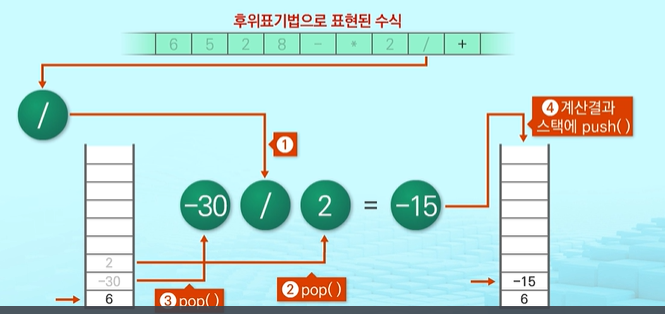
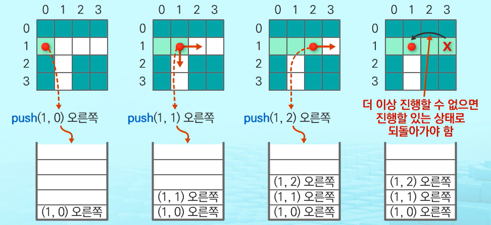

# STACK_2

## 1. 계산기

#### 1) 계산기에서의 Stack의 활용


- 문자열 수식 계산의 일반적 방법
  
  __Step 1__ 중위표기법의 수식을 후위표기법으로 변경
  
  - 스택이용
  
  - 중위표기법(infix notation): 연산자를 피연산자의 가운데 표기하는 방법
    
    - ex)  A + B
  
  __Step 2__ <u>후위표기법</u>의 수식을 이용하여 계산
  
  - 후위표기법(postfix notation): 연산자를 피연산자 뒤에 표기하는 방법
    
    - ex)  A B +

#### 2) 중위표기식을 후위표기식으로 변환

- __Step 1__.  중위표기식의 후위표기식으로 변환방법 1
  
  1. 수식의 각 연산자에 대해서 우선순위에 따라 괄호를 사용하여 다시 표현
  
  2. 각 연산자를 그에 대응하는 오른쪽 괄호의 뒤로 이동
  
  3. 괄호 제거
  
  

- __Step 1__. 중위표기식의 후위표기식으로 변환방법 2(스택이용)
  
  1. 입력 받은 중위표기식에서 토큰을 읽음
  
  2. 토큰이 피연산자이면 토큰을 출력
  
  3. 토큰이 연산자(괄호포함)일 경우
     
     - 우선순위가 높으면 -> 스택에 push
     
     - 우선순위가 안높으면 -> 연산자의 우선순위가 토큰의 우선순위보다 작을 때까지 pop한 후 토큰의 연산자를 push
     
     - 만약 top에 연산자가 없으면 -> push
  
  4. 토큰이 오른쪽 괄호 ')'일 경우
     
     - 스택 top에 왼쪽 괄호 '('가 올 때 까지 스택에 pop을 연산을 수행
     
     - pop한 연산자를 출력
     
     - 왼쪽 괄호를 만나면 pop만 하고 출력하지는 않음
  
  5. 중위표기식에 더 읽을 것이 없다면 중지, 더 읽을 것이 있다면 1부터 반복
  
  6. 스택에 남아있는 연산자를 모두 pop하여 출력
     
     - 스택 밖의 왼쪽 괄호는 우선순위가 가장 높으며, 스택 안의 왼쪽 괄호는 우선순위가 가장 낮음
  
  
  
  

#### 3) 후위표기법의 수식을 스택을 이용하여 계산

1. 피연산자를 만나면 스택에 push함

2. 연산자를 만나면 필요한 만큼의 피연산자를 스택에서 pop하여 연산하고, 연산결과를 다시 스택에 push함

3. 수식이 끝나면, 마지막으로 스택을 pop하여 출력
   
   - 계산 시 주의 사항
     
     - 후위표기식을 계산 시, <u>피연산자를 스택에 쌓아 계산!!</u>





#### 4) 수식을 eval()내장 함수로 계산

- 문자열로 된 수식을 계산 시
  
  - 스택을 두 번 사용해서 처리했던 연산을 파이썬에서 제공되는 __eval() 내장함수__ 로 계산할 수 있음
  
  - __eval(수식)__
    
    - 문자열로 된 수식을 계산함
    
    - Evaluation = '값을 구함'이라는 뜻
    
    - 올바른 수식이 아닌 경우 SyntaxError 예외가 발생함
    
    - __eval('6+5*(2-8)/2')__ 는 문자열로 된 수식의 계산결과를 반환 함

___

_____

## 2. 백트래킹

#### 1) 백트래킹(Backtracking)

- __백트래킹(Backtracking)__
  
  - 해를 찾는 도중에 <u>막히면</u>, (즉, 해가 아니면)되돌아가서 다시 해를 찾아가는 기법
  
  - 백트래킹 기법으로 __최적화(Optimization) 문제__ 와 __결정문제(Dicision) 문제__ 를 <u>해결할 수 있음</u>
    
    - __최적화(Optimization)__ 문제
    
    - __결정(Dicision) 문제__
      
      - 문제의 조건을 만족하는 해가 존재하는지의 여부를 'yes' 또는 'no'로 답하는 문제
      
      - 미로찾기
      
      - n-Queen 문제
      
      - Map coloring
      
      - 부분집합의 합(Subset Sum) 문제 등

#### 2) 백트래킹 - 미로찾기

- 예) 백트래킹 기법 활용 - 미로 찾기
  
  1. 입구와 출구가 주어진 미로에서 입구부터 출구까지의 경로를 찾는 문제
  
  2. 이동할 수 있는 방향은 4방향으로 제한
  
  

- 예) 백트래킹 기법 활용 - 미로찾기 알고리즘 

        


#### 3) 백트래킹 알고리즘의 특징

- 백트래킹과 깊이 우선 탐색의 차이
  
  - 백트래킹
    
    - 어떤 노드에서 출발하는 경로가 해결책으로 이어질 것 같지 않으면 더 이상 그 경로를 따라가지 않음으로써 __시도의 횟수를 줄임__
    
    - 가지치기(Prunning)
    
    - 불필요한 경로의 조기 차단
    
    - __N!__ 가지의 경우의 수를 가진 문제에 대해 백트래킹에 가하면 일반적으로 <u>경우의 수가 줄어들지만</u> 이 역시 최악의 경우에는 여전히 지수함수 시간(Exponential Time)을 요하므로 처리 불가능
    
    - 모든 후보를 검사하지 않음
  
  - 깊이 우선 탐색
    
    - 모든 경로를 추적
    
    - __N!__ 가지의 경우의 수를 가진 문제에 대해 깊이우선 탐색을 가하면 __처리불가능한 문제__
    
    - 모든 후보를 검사

- 백트래킹 기법
  
  - 어떤 노드의 __유망성__ 을 점검한 후에 유망(Promising)하지 않다고 결정되면 그 노드의 부모로 되돌아가(Backtraking) 다음 자식 노드로 감
  
  - 어떤 노드를 방문하였을 때 __그 노드를 포함한 경로가 해답이 될 수 없으면__ 그 노드는 <span style='color:red'><u>유망하지 않다고 함</u></span>
  
  - 반대로 __해답의 가능성이 있으면 유망하다__ 고 함
  
  - 가지치기(Prunning): 유망하지 않은 노드가 포함되는 경로는 더 이상 고려하지 않는 방법으로 탐색하는 경우의 수를 줄일 수 있음

#### 3) 백트래킹 알고리즘의 특징

- 백트래킹을 이용한 알고리즘의 절차
  
  1. 상태공간 Tree의 깊이우선 검색을 실시
  
  2. 각 노드가 유망한지를 점검
  
  3. 만일 그 노드가 유망하지 않으면, 그 노드의 부모노드로 돌아가서 검색을 계속함

#### 4) 백트래킹 알고리즘

- 일반 백트래킹 알고리즘 - <span style='background-color:#fff5b1'>n-Queen 문제 </span>
  
  - n*n의 정사각형 안에 n개의 queen을 배치하는 문제로, 모든 queen은 자신의 일직선상 및 대각선상에 아무 것도 놓이지 않아야 함

```python
def checknode(v):
    if promising(v):
        if there is a solution at v:
            write the solution


        else:
            for u in each child of v:
                chechnode(u)
```


- 앞의 내용을 상태 공간 트리로 표시하면 위와 같음
  
  - 문제 수행이 불가능해지는 노드는 사전에 탐색을 중지하기 때문에 깊이 우선 탐색보다 노드 수가 매우 적은 것을 확인 할 수 있음

- 깊이 우선 탐색 vs 백트래킹
  
  - 순수한 깊이 우선 탐색은 <span style='background-color:#fff5b1'> 155노드 </span>
  
  - 백트래킹은 <span style='background-color:#fff5b1'>27 노드</span>
    
    - 백트래킹 기법의 수행시간이 순수한 깊이 우선 탐색의 1/5 소요 되는 것을 확인할 수 있음

#### 5) 백트래킹 - Power Set

- __Power Set__
  
  - 어떤 집합의 공집합과 자기 자신을 포함한 모든 부분 집합
  
  - 구하고자 하는 어떤 집합의 원소 개수가 n일 경우 부분 집합의 개수는 $2^n$ 이 나옴

- 백트래킹 기법으로 Power Set 구하기
  
  - 일반적인 백트래킹 접근방법 이용
  
  - n개의 원소가 들어있는 집합의 $2^n$개의 부분집합을 만들 때, True 또는 False값을 가지는 항목들로 구성된 n개의 리스트를 만드는 방법 이용
  
  - 리스트의 i번째 항목은 i번째 원소가 부분집합 값인지 아닌지를 나타내는 값

```python
def backtrack(a, k, input):
    global MAXCANDIDATES
    c = [0] * MAXCANDIDATES

    if k == input:
        process_solution(a, k) #답이면 원하는 작업을 한다

    else:
        k+=1
        ncandidates = construct_candidates(a, k, input, c)
        for i in range(ncandidates):
            a[k] = c[i]
            backtrack(a, k, input)
```

```python
#후보군 생성 함수
def construct_candidates(a, k, input, c):
    c[0] = True
    c[1] = False
    return 2

MAXCANDIDATES=100
NMAX = 100
a = [0] * NMAX
backtrack(a, 0, 3)
```


- 순열을 구하는 백트래킹 알고리즘

```python
def backtrack(a, k, input):
    global MAXCANDIDATES
    c = [0] * MAXCANDIDATES

    if k == input:
        for i in range(1, k + 1):
            print(a[i], end='')
        print()
    else:
        k+=1
        ncandidates = construct_candidates(a, k, input, c)
        for i in range(ncandidates):
            a[k] = c[i]
            backtrack(a, k, input)
```

```python
# 후보군을 구하는 함수
def construct_candidates(a, k, input, c):
    in_perm = [False] * NMAX

    for i in range(1, k):
        in_perm[a[i]] = True

    ncandidates = 0

    for i in range(1, input+1):
        if in_perm[i] == False:
            c[ncandidates] = i
            ncandidates += 1
    return ncandidates
```
